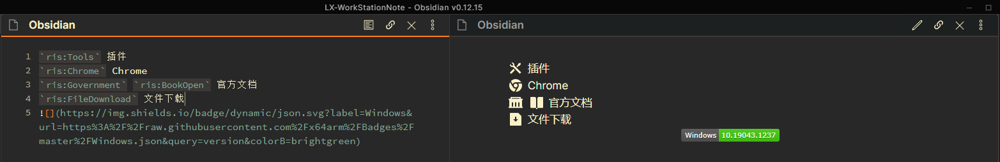
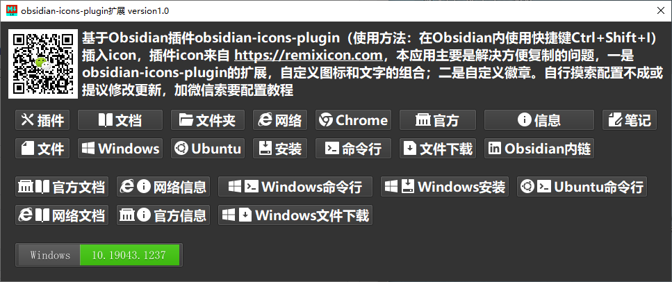

# ObsidianIconBadge
Obsidian笔记( http://obsidian.md )obsidian-icons-plugin插件的Windows客户端扩展插件
基于Obsidian插件obsidian-icons-plugin（ https://github.com/visini/obsidian-icons-plugin ,使用方法：在Obsidian内使用快捷键Ctrl+Shift+I）插入icon( http://remixicon.com )，本应用主要是解决方便复制的问题，一是obsidian-icons-plugin的扩展，自定义图标和文字的组合；二是自定义徽章。自行摸索配置不成或提议修改更新，加微信索要配置教程  

